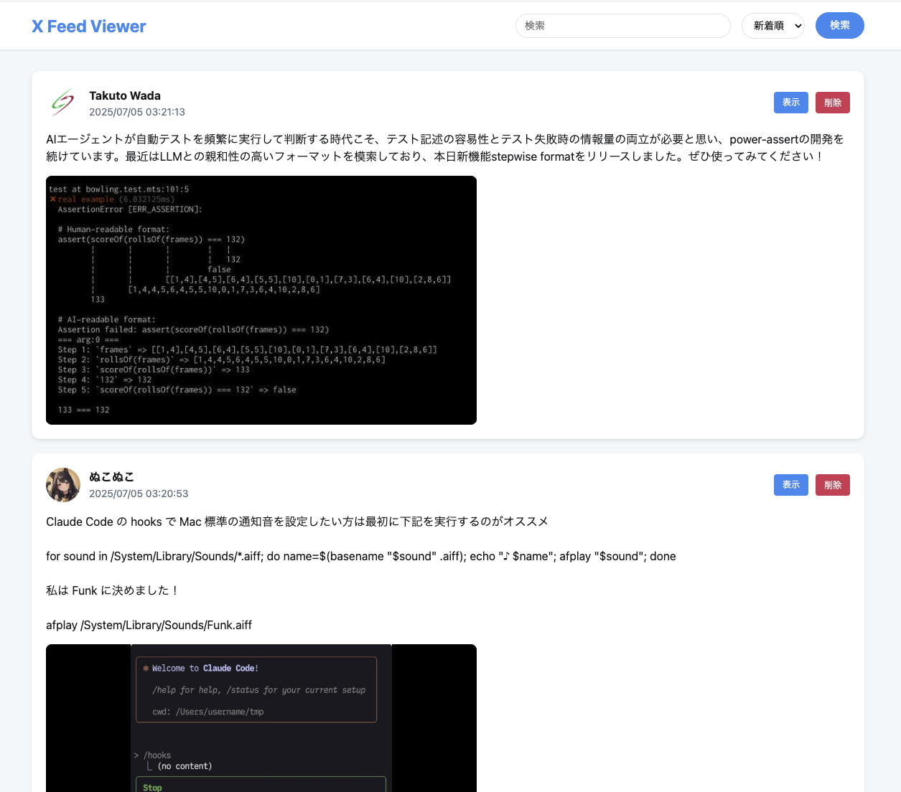

# ① 課題名

X のポストを保存するアプリ

## ② 課題内容（どんな作品か）

Chrome Extension で X ポストに保存ボタンを表示し、押下するとサーバの DB に保存されるアプリ。
X だと自分のいいねしたポスト内で検索などをすることができないため、保存しておくことで検索ができるようにするそうてい(検索機能はまだ未実装)

## ③ アプリのデプロイ URL

- https://x-fab-php-app-riicjqaxya-an.a.run.app/feeds
- デバッグ用の投稿画面: https://x-fab-php-app-riicjqaxya-an.a.run.app/api/debug.php
- 保存ボタンは/x-fab-chrome-extension を Chrome 拡張としてインストールする必要あり

### Chrome 拡張


### 保存したフィード一覧ページ



## ④ アプリのログイン用 ID または Password（ある場合）

- なし

## ⑤ 工夫した点・こだわった点

- Cloud Run、Cloud SQL、Docker を使用。

## ⑥ 難しかった点・次回トライしたいこと（又は機能）

- Vibe Coding してしまったので、ちゃんとソースを読む

## ⑦ フリー項目（感想、シェアしたいこと等なんでも）

# X Feed Saver

X（旧 Twitter）のフィードを保存・管理するための Chrome 拡張機能と PHP アプリケーションです。

## 機能

- Chrome 拡張機能で X のフィードに「保存」ボタンを追加
- フィード情報（URL、ユーザー名、投稿内容、画像、動画、引用ツイート）をデータベースに保存
- 保存したフィードの閲覧・検索・削除機能
- レスポンシブデザイン対応

## 必要な環境

- XAMPP（Apache + MySQL + PHP）
- Google Chrome（拡張機能の開発者モード）
- phpMyAdmin（データベース管理）

## セットアップ手順

### 1. プロジェクトの配置

#### 自動配置スクリプトを使用する場合（Mac）

配置スクリプトを使用すると、自動的に XAMPP に必要なファイルがコピーされます：

```bash
# プロジェクトディレクトリに移動
cd /path/to/lesson_php02_assignment

# スクリプトを実行
./deploy_to_xampp.sh
```

スクリプトが以下を自動的に実行します：

- XAMPP のインストール確認
- ファイルのコピー
- パーミッションの設定
- .env ファイルの作成

#### 手動で配置する場合

XAMPP の htdocs ディレクトリに`x-fab-php-app`フォルダを配置します：

```bash
# Windowsの場合
C:\xampp\htdocs\x-fab-php-app

# Macの場合
/Applications/XAMPP/htdocs/x-fab-php-app
```

### 2. データベースのセットアップ

1. XAMPP を起動し、Apache と MySQL を開始
2. ブラウザで http://localhost/phpmyadmin にアクセス
3. 左サイドバーで「新規作成」をクリックするか、トップメニューの「SQL」タブを開く
4. 以下の SQL を実行（`x-fab-php-app/setup.sql`の内容と同じ）：

```sql
CREATE DATABASE IF NOT EXISTS x_fab_db CHARACTER SET utf8mb4 COLLATE utf8mb4_unicode_ci;

USE x_fab_db;

CREATE TABLE IF NOT EXISTS x_feeds (
    id INT AUTO_INCREMENT PRIMARY KEY,
    feed_url VARCHAR(500) NOT NULL,
    user_name VARCHAR(200) NOT NULL,
    user_icon_url VARCHAR(500),
    post_content TEXT NOT NULL,
    post_date DATETIME,
    feed_data JSON,
    created_at DATETIME DEFAULT CURRENT_TIMESTAMP,
    INDEX idx_created_at (created_at)
) ENGINE=InnoDB DEFAULT CHARSET=utf8mb4 COLLATE=utf8mb4_unicode_ci;
```

### 3. 環境設定

1. `x-fab-php-app/.env.example`を`.env`にコピー（既に作成済み）
2. 必要に応じて`.env`ファイルを編集：

```
DB_HOST=localhost
DB_NAME=x_fab_db
DB_USER=root
DB_PASS=
DB_PORT=3306
ENV=development
API_URL=http://localhost/x-fab-php-app/api
```

### 4. 動作確認

1. データベース接続テスト：

   ```
   http://localhost/x-fab-php-app/test_db.php
   ```

2. API デバッグページ：

   ```
   http://localhost/x-fab-php-app/api/debug.php
   ```

3. フィード閲覧ページ：
   ```
   http://localhost/x-fab-php-app/feeds
   ```

### 5. Chrome 拡張機能のインストール

1. Chrome で `chrome://extensions/` を開く
2. 右上の「デベロッパーモード」を ON にする
3. 「パッケージ化されていない拡張機能を読み込む」をクリック
4. `x-fab-chrome-extension`フォルダを選択
5. 拡張機能が有効になったことを確認

### 6. 使い方

1. https://x.com にアクセス
2. 各フィードの右上に「保存」ボタンが表示される
3. ボタンをクリックすると、フィード情報がデータベースに保存される
4. http://localhost/x-fab-php-app/feeds で保存したフィードを閲覧

## ディレクトリ構造

```
lesson_php02_assignment/
├── x-fab-chrome-extension/     # Chrome拡張機能
│   ├── manifest.json          # 拡張機能の設定
│   ├── content.js             # コンテンツスクリプト
│   └── icons/                 # アイコンファイル
│
├── x-fab-php-app/             # PHPアプリケーション
│   ├── api/                   # APIエンドポイント
│   │   ├── save.php          # フィード保存
│   │   ├── list.php          # 一覧取得
│   │   ├── delete.php        # 削除
│   │   └── debug.php         # デバッグページ
│   ├── includes/              # 共通処理
│   ├── assets/                # CSS/JS
│   ├── .env                   # 環境変数
│   └── index.php              # 閲覧ページ
│
├── docs/                      # ドキュメント
├── deploy_to_xampp.sh         # XAMPP配置スクリプト（Mac用）
├── deploy_with_existing_sql.sh # Cloud Runデプロイスクリプト
├── .env.deploy.example        # デプロイ設定テンプレート
└── README.md                  # このファイル
```

## トラブルシューティング

### データベース接続エラー

- XAMPP の MySQL が起動しているか確認
- `.env`ファイルの設定が正しいか確認
- `test_db.php`でエラー詳細を確認

### phpMyAdmin でのエラー

#### Error: #1046 データベースが選択されていません

このエラーが出た場合は、以下の手順で解決：

1. phpMyAdmin のトップページから「SQL」タブを開く
2. `setup.sql`の内容を全てコピー＆ペースト（`USE x_fab_db;`を含む）
3. 実行

または、詳細な手順は `docs/phpmyadmin_setup_guide.md` を参照してください。

### Chrome 拡張機能が動作しない

- デベロッパーモードが ON になっているか確認
- 拡張機能のエラーログを確認（拡張機能ページの「エラー」ボタン）
- ページをリロードして再試行

### API エラー

- `/api/debug.php`で API の動作を確認
- ブラウザの開発者ツールでネットワークエラーを確認
- PHP のエラーログを確認

## ファイル整理について

### デプロイ関連ファイル

本プロジェクトでは、Cloud Run へのデプロイ過程で複数の試行錯誤を行いました。最終的に使用するファイルのみを残し、以下のファイルを整理しました：

#### 削除したファイル：

- `Dockerfile.cloudrun`, `Dockerfile.final`, `Dockerfile.gcp`, `Dockerfile.production`, `Dockerfile.simple` → `Dockerfile`に統合
- `x-fab-php-app/deploy-final.sh`, `x-fab-php-app/start.sh` → 不要なスクリプト

#### 現在のファイル構成：

- `x-fab-php-app/Dockerfile` - Cloud Run 用の最終的な Dockerfile
- `deploy_with_existing_sql.sh` - 既存の Cloud SQL インスタンスを使用するデプロイスクリプト
- `.env.deploy.example` - デプロイ設定のテンプレート
- `.env.deploy` - 実際のデプロイ設定（.gitignore で管理）

## Cloud Run + Cloud SQL へのデプロイ

### 前提条件

- Google Cloud SDK がインストール済み
- Google Cloud プロジェクトが作成済み
- 請求先アカウントが設定済み

### デプロイ手順

#### 1. Google Cloud SDK のセットアップ

```bash
# Macの場合
brew install --cask google-cloud-sdk

# ログイン
gcloud auth login
```

#### 2. デプロイ手順

##### 既存の Cloud SQL インスタンスを使用する場合

```bash
# 1. 環境変数ファイルの準備
cp .env.deploy.example .env.deploy

# 2. .env.deployを編集して実際の値を設定
#    PROJECT_ID, CLOUD_SQL_INSTANCE, CONNECTION_NAME等を設定

# 3. x-fab-php-appディレクトリに移動
cd x-fab-php-app

# 4. デプロイスクリプトの実行
../deploy_with_existing_sql.sh

# 5. プロンプトに従ってパスワードを入力
```

新規でセットアップする場合は、[DEPLOY_GUIDE.md](DEPLOY_GUIDE.md)を参照してください。

#### 3. データベーステーブルの作成

スクリプトの指示に従い、別のターミナルで：

```bash
# Cloud SQL Proxyのダウンロード（初回のみ）
curl -o cloud_sql_proxy https://dl.google.com/cloudsql/cloud_sql_proxy.darwin.amd64
chmod +x cloud_sql_proxy

# Proxyの起動（CONNECTION_NAMEはスクリプトが表示）
./cloud_sql_proxy -instances=CONNECTION_NAME=tcp:3307

# 別のターミナルでSQLを実行
mysql -h 127.0.0.1 -P 3307 -u x_fab_user -p x_fab_db < x-fab-php-app/setup.sql
```

#### 4. Chrome 拡張機能の更新

本番環境用の URL は既に設定済みです：

- **現在の本番環境 URL**: `https://x-fab-php-app-riicjqaxya-an.a.run.app`
- **content.js**: 本番環境 URL が設定されています
- **content.prod.js**: 本番環境専用の設定ファイル（.gitignore で管理）

新しいデプロイを行った場合は、表示された URL で content.js を更新してください。

### デプロイ後の確認

- アプリケーション: `https://YOUR-CLOUD-RUN-URL`
- フィード一覧: `https://YOUR-CLOUD-RUN-URL/feeds`
- API デバッグ: `https://YOUR-CLOUD-RUN-URL/api/debug.php`

### 料金の目安

- Cloud SQL (db-f1-micro): 約$15/月
- Cloud Run: リクエスト数に応じて（無料枠あり）

### リソースの削除

使用を終了する場合：

```bash
# Cloud Runサービスの削除
gcloud run services delete x-fab-php-app --region=asia-northeast1

# Cloud SQLインスタンスの削除
gcloud sql instances delete x-fab-db
```

詳細は[DEPLOY_GUIDE.md](DEPLOY_GUIDE.md)を参照してください。

## 今後の開発予定

- ユーザー認証機能
- エクスポート機能
- 統計情報表示
